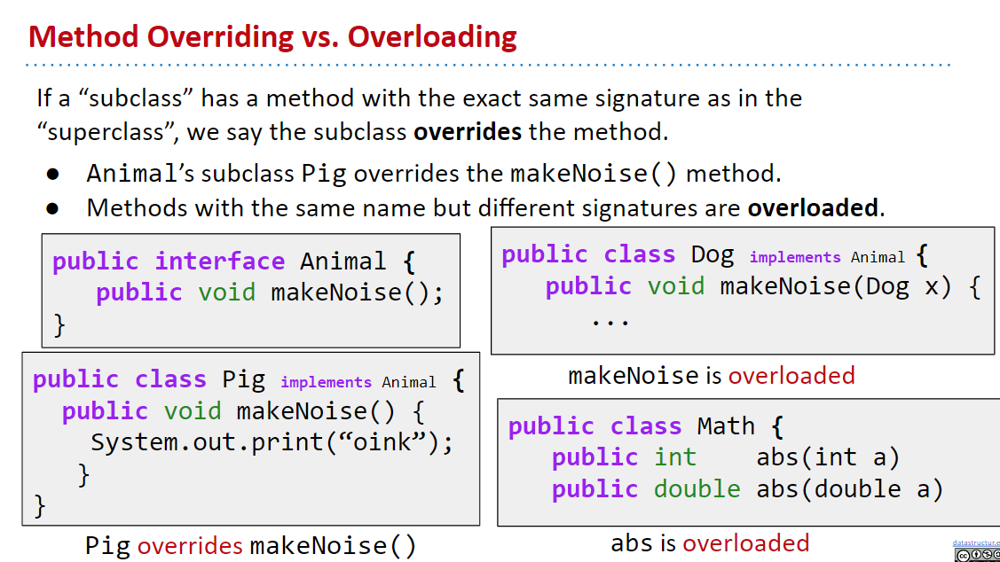

<p style="font-size:30px;">Java-OOP</p>

1 Java类的成员：成员变量 方法 构造器，（代码块 内部类）

2 面向对象特征：封装 继承 多态，（抽象）

3 其他关键字： this、super、package、import、static、final、interface、abstract 等

---

`接口`在封装、继承和多态中起到了桥梁的作用。它们通过接口相互连接，共同构成了面向对象编程的一个完整体系。

封装通过接口实现数据和实现的隐藏，继承通过接口实现代码的复用，而多态则通过接口实现不同对象之间的互操作。

封装：封装是指隐藏对象的属性和实现细节，仅对外提供操作接口。通过封装，可以保证对象内部的状态和实现细节不被外部干扰和滥用，同时也是实现接口与实现分离的一个重要手段。接口本身就是一种封装，它定义了可以执行哪些操作，但不规定这些操作的具体实现。

继承：继承是子类自动共享父类数据结构和方法的机制。这不仅可以使得代码更加简洁，避免重复，还可以在现有基础上进行扩展。接口可以被继承和实现，允许不同的类共享一套接口规范。

多态：多态允许不同的对象对同一消息做出响应。接口在多态中发挥着关键作用。通过面向接口编程，可以在运行时确定调用对象的具体类型，实现运行时的绑定，这是多态性的一种表现。

---

<p style="font-size:20px;">目录</p>

<!-- TOC -->

- [0 面向对象编程](#0-面向对象编程)
- [1 Java类](#1-java类)
    - [Controlling Access to Members of a Class](#controlling-access-to-members-of-a-class)
- [2 抽象 抽象数据类型ADT](#2-抽象-抽象数据类型adt)
    - [什么是ADT，为何要使用ADT](#什么是adt为何要使用adt)
- [2 接口](#2-接口)
- [3 继承 Inheritance](#3-继承-inheritance)
    - [从接口interface：（implements接口）](#从接口interfaceimplements接口)
        - [接口继承 interface inheritance](#接口继承-interface-inheritance)
        - [实现继承 Implementation Inheritance：Default Methods，使用关键字Default](#实现继承-implementation-inheritancedefault-methods使用关键字default)
    - [从父类superclass:（Extends父类）是实现继承Implementation Inheritance](#从父类superclassextends父类是实现继承implementation-inheritance)
- [4 多态](#4-多态)
    - [高阶函数 Higher Order Functions](#高阶函数-higher-order-functions)
    - [Subtype Polymorphism（子类型多态性）vs. Explicit Higher Order Functions (显示高阶函数)](#subtype-polymorphism子类型多态性vs-explicit-higher-order-functions-显示高阶函数)
- [5 抽象类 抽象方法（abstract 关键字）](#5-抽象类-抽象方法abstract-关键字)

<!-- /TOC -->

# 0 面向对象编程
软件开发中的编程风格、开发范式：除了面向对象，还有面向过程、指令式编程和函数式编程

类作为设计的关键

# 1 Java类
成员：成员变量 方法 构造器，（代码块 内部类）

抽象的 类Class  --- 具体的 对象Object （实例instance）

## Controlling Access to Members of a Class


# 2 抽象 抽象数据类型ADT
- Abstract data types 抽象数据类型
- Representation independence 表征独立性
## 什么是ADT，为何要使用ADT


# 2 接口

接口是一种特殊的抽象类，所有的方法都是抽象的。接口定义了类或对象应遵守的规范，它规定了可以对一个对象执行哪些操作。接口是一种形式的契约，在面向对象编程中，通过实现一个或多个接口，一个类可以承诺提供某些功能。这种机制是封装的一个体现，因为接口隐藏了具体实现的细节。

Implements（实现）

引用数据类型：数组，类，枚举，接口，注解。

接口的定义，它与定义类方式相似，但是使用 interface 关键字。它也会被编译成.class 文件，但一定要明确它并不是类，而是另外一种引用数据类型。

接口内部结构的说明：
- 可以声明：
    - 属性：必须使用public static final修饰（公共的静态常量）
    - 方法：
        
        jdk8之前：声明抽象方法，修饰为public abstract；<br>
        jdk8:声明静态方法、默认方法；<br>
        jdk9:声明私有方法<br>

- 不可以声明：构造器、代码块等

- 在 JDK8.0 之前，接口中只允许出现：
    - （1）公共的静态的常量：其中 public static final 可以省略
    - （2）公共的抽象的方法：其中 public abstract 可以省略

        理解：接口是从多个相似类中抽象出来的规范，不需要提供具体实现
- 在 JDK8.0 时，接口中允许声明默认方法和静态方法：
    - （3）公共的默认的方法：其中 public 可以省略，建议保留，但是 default 不能省略
    - （4）公共的静态的方法：其中 public 可以省略，建议保留，但是 static 不能省略
- 在 JDK9.0 时，接口又增加了：
    - （5）私有方法

        除此之外，接口中没有构造器，没有初始化块，因为接口中没有成员变量需要动态初始化。

```
interface Flyable{  //接口
    //全局常量
    //公共的静态常量，可以省略public static final
    public static final int MIN_SPEED = 0;
    int MAX_SPEED = 7900;

    //公共的抽象方法，可以省略public abstract 声明
    public abstract void fly();
}

```


# 3 继承 Inheritance
Java中的Object类是所有类的根类，也是Java类层次结构的顶级父类。每个类在Java中都直接或间接地继承自Object类，因此Object类中定义的方法对于所有的Java对象都是可用的。
## 从接口interface：（implements接口）
接口：定义要做什么，而不是怎么做 

通过方法的重写@Override在子类实现接口      `@Override`只是一个辅助标记

方法重写和重载的不同

### 接口继承 interface inheritance

Subclass inherits signatures, but NOT implementation.

接口中声明方法不能有方法体


### 实现继承 Implementation Inheritance：Default Methods，使用关键字Default

接口中的方法使用Default关键字，可以有方法体    (JDK8.0)

Subclasses can inherit signatures AND implementation


JDK8.0 及 JDK9.0 后更多特性看接口文档

## 从父类superclass:（Extends父类）是实现继承Implementation Inheritance


# 4 多态

## 高阶函数 Higher Order Functions

## Subtype Polymorphism（子类型多态性）vs. Explicit Higher Order Functions (显示高阶函数)


# 5 抽象类 抽象方法（abstract 关键字）
将一个父类设计得非常抽象，以至于它没有具体的实例，这样的类叫做抽象类

abstract可以用来修饰：类、方法

- 抽象类的语法格式(此类称为抽象类)

    [权限修饰符] abstract class 类名{ }

    [权限修饰符] abstract class 类名 extends 父类{ }

    - 抽象类不能实例化。
    - 抽象类中是包含构造器的，因为子类对象实例化时，需要直接或间接的调用到父类的构造器。
    - 抽象类中可以没有抽象方法。反之，抽象方法所在的类，一定是抽象类。
- 抽象方法的语法格式(此方法即为抽象方法)

    [其他修饰符] abstract 返回值类型 方法名([形参列表]);
    注意：抽象方法没有方法体
    - 抽象方法只有方法的声明，没有方法体。
    - 抽象方法其功能是确定的（通过方法的声明即可确定），只是不知道如何具体实现（体现为没有方法体）
    - 子类必须重写父类中的所有的抽象方法之后，方可实例化。否则，此子类仍然是一个抽象类。


abstract不能使用的场景：
- abstract 不能修饰哪些结构？
    - 属性、构造器、代码块等。
- abstract 不能与哪些关键字共用？（自洽）
    - 不能用abstract修饰私有方法、静态方法、final的方法、final的类。

        私有方法不能重写；避免静态方法使用类进行调用；final的方法不能被重写；final修饰的类不能有子类


